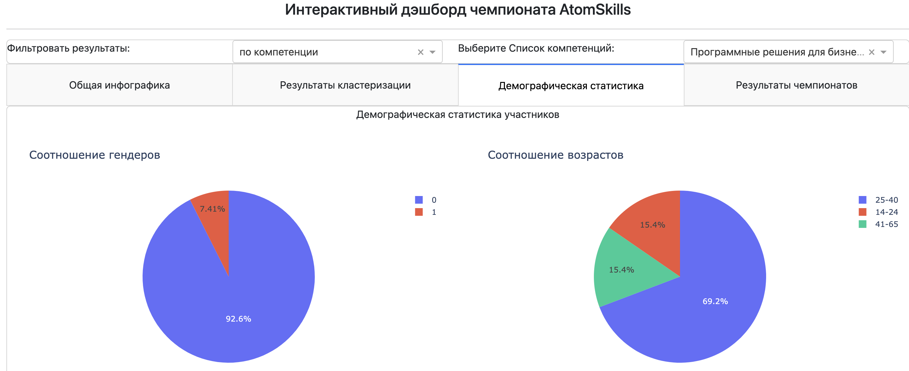
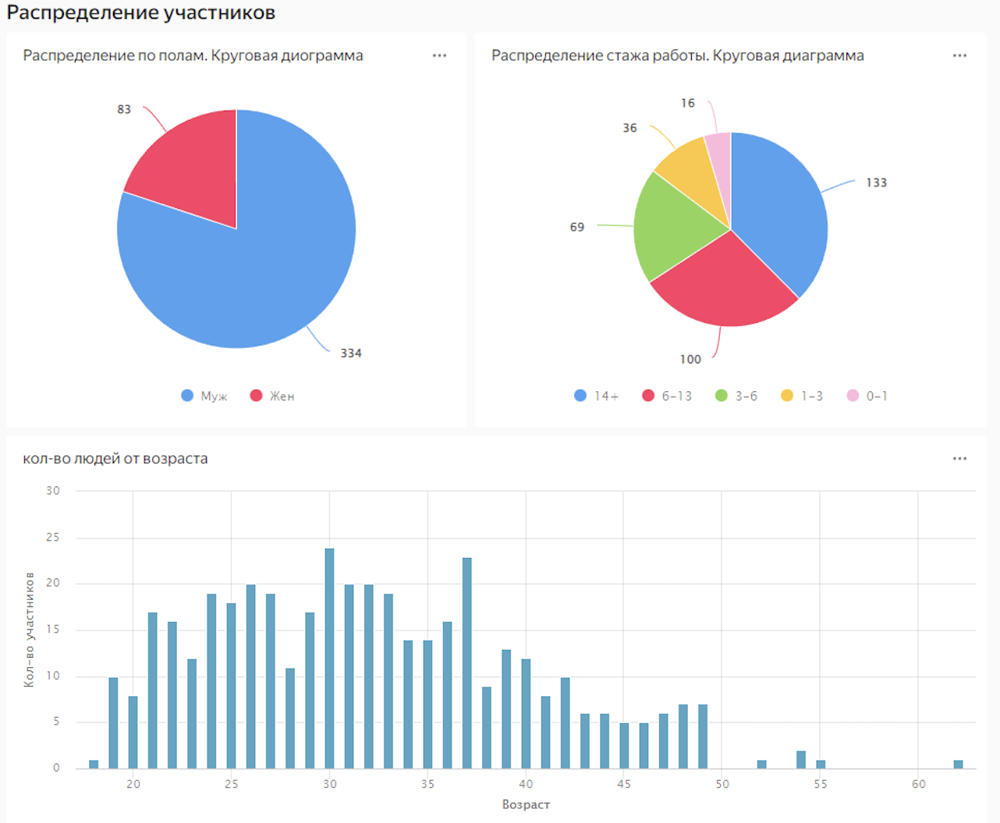

# Clustering of championship participants

The project is designed for clustering championship participants and subsequent analytics using a dashboard

Link to dashboard: https://datalens.yandex/5olr3586ak26v

## Installation

1. git clone https://github.com/TechNumber/energoose_dashboard.git
2. cd energoose_dashboard
3. pip install -r requirements.txt

## Running the scripts

To use the clustering script, run the following command:

```console
python run_clustering.py
```

To use the processing workplaces parser, run the following command:
```console
python processing_workplaces.py
```

## Usage
To use the clustering method for specified data, you should open configs/cluster_config.yaml and change params for your case:

- input_file (str): path to the input csv file
- path_to_csv_files (str): path to the csvs files which you want merge with participants csv
- categorical_columns (list of str): categorical columns that you want to use for clustering
- numeric_columns (list of str): numeric columns that you want to use for clustering
- output_file (str): path to the output csv file with clustering and all preprocessing
- cluster_method (str, choice): choose a clustering method
- workplace_output (str): path to the save preprocessed workplace column in csv

## Tree of project

```bash
├── clustered_data  # Folder for storage clustered csvs
│   └── clustered.csv
├── configs. # Folder for configs
│   └── cluster_config.yaml  # Config for cluster script
├── data. # Folder for storage source data
│   ├── anonimized
│   └── Участники anonimized.csv
├── run_clustering.py  # Script for run clustering preprocessed data and save final file in csv
├── run_dashboard.py  # Script for run dashboard
├── requirements.txt
└── utils
    ├── clustering.py  # Script for init cluster method and make cluster predict
    └── preprocessing  # Folder for storage preprocessing scripts
        ├── column_processing_ages.py  # Script for preprocessing ages columns
        ├── column_processing_category.py  # Script for preprocessing category columns
        ├── merge_tables.py  # Script for merge csvs in anonimized folder with participants csv
        ├── preprocess_functioncs.py  # Script which run all our preprocessing scripts for specified data
        ├── processing_interval_groups.py  # Script for processing some columns to group category
        └── processing_workplaces.py  # Script for processing workplace column
```

## Running dashboard
To run dashboard, you should run the following command:
```console
python run_dashboard.py
```

You see this in terminal:
```console
Dash is running on http://127.0.0.1:8050/

 * Serving Flask app 'run_dashboard'
 * Debug mode: on
```
You should to go to the following link http://127.0.0.1:8050/ and then you will see the dashboard running

Example of a plotly dashboard beloew:


## Examples of what a dashboard looks like in datalens




